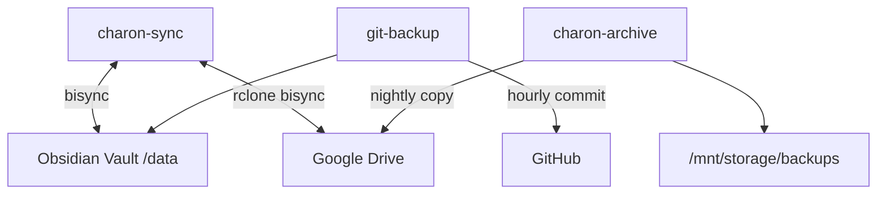

# Charon

The Ferryman — storage, sync, and persistence for the Yggdrasil ecosystem. Three services ferry data between Gaia's vault and the cloud.



## Services

| Service | Role | Schedule |
|---------|------|----------|
| charon-sync | Bi-directional vault sync with Google Drive via rclone bisync | Every 5min |
| charon-archive | Nightly backup of infrastructure dumps to Google Drive | 3am NZT |
| git-backup | Hourly git commits of vault to private GitHub repo | Hourly |

## Networks

- `aether-net` — external overlay for Google Drive API access
- `internal` — stack-internal overlay

## Quick Deploy

```bash
git submodule update --init --recursive
chmod +x setup_host.sh && ./setup_host.sh
./scripts/deploy.sh "charon" docker-compose.yml
```

## Full Documentation

Operational details, environment variables, secrets, backup architecture, pitfalls, and historical context live in the vault at `Areas/90-Infrastructure/Charon/Charon Stack.md`.
